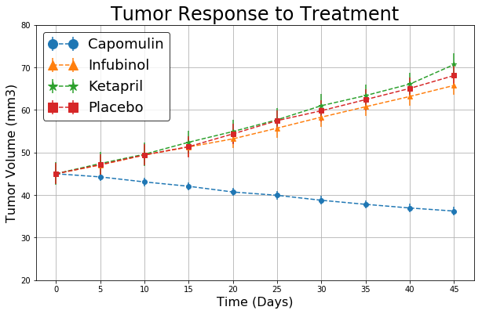
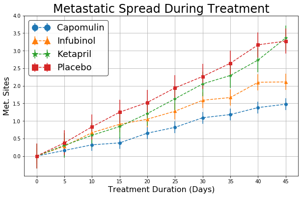
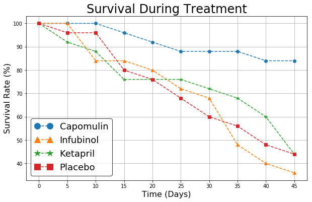
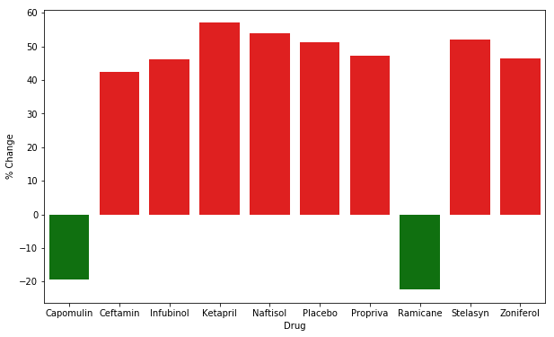

```python
import pandas as pd
import numpy as np
import matplotlib.pyplot as plt
import seaborn as sns 
```


```python
#File Paths
file_1 = "raw_data/clinicaltrial_data.csv"
file_2 = "raw_data/mouse_drug_data.csv"

#File Reads
clinical_trial_data = pd.read_csv(file_1)
mouse_drug_data = pd.read_csv(file_2)

#Merge files together into one DataFrame
merged_file = pd.merge(clinical_trial_data, mouse_drug_data, left_index=True, on="Mouse ID")

#Display output
merged_file.head()
```


<div>
<style scoped>
    .dataframe tbody tr th:only-of-type {
        vertical-align: middle;
    }

    .dataframe tbody tr th {
        vertical-align: top;
    }

    .dataframe thead th {
        text-align: right;
    }
</style>
<table border="1" class="dataframe">
  <thead>
    <tr style="text-align: right;">
      <th></th>
      <th>Mouse ID</th>
      <th>Timepoint</th>
      <th>Tumor Volume (mm3)</th>
      <th>Metastatic Sites</th>
      <th>Drug</th>
    </tr>
  </thead>
  <tbody>
    <tr>
      <th>75</th>
      <td>b128</td>
      <td>0</td>
      <td>45.000000</td>
      <td>0</td>
      <td>Capomulin</td>
    </tr>
    <tr>
      <th>75</th>
      <td>b128</td>
      <td>5</td>
      <td>45.651331</td>
      <td>0</td>
      <td>Capomulin</td>
    </tr>
    <tr>
      <th>75</th>
      <td>b128</td>
      <td>10</td>
      <td>43.270852</td>
      <td>0</td>
      <td>Capomulin</td>
    </tr>
    <tr>
      <th>75</th>
      <td>b128</td>
      <td>15</td>
      <td>43.784893</td>
      <td>0</td>
      <td>Capomulin</td>
    </tr>
    <tr>
      <th>75</th>
      <td>b128</td>
      <td>20</td>
      <td>42.731552</td>
      <td>0</td>
      <td>Capomulin</td>
    </tr>
  </tbody>
</table>
</div>


### Tumor Response to Treatment


```python
#Calculate average tumor volume change over time for each drug
avg_volume = pd.DataFrame(merged_file.groupby(["Drug","Timepoint"])["Tumor Volume (mm3)"].mean())

#Display DataFrame
avg_volume
```


<div>
<style scoped>
    .dataframe tbody tr th:only-of-type {
        vertical-align: middle;
    }

    .dataframe tbody tr th {
        vertical-align: top;
    }

    .dataframe thead th {
        text-align: right;
    }
</style>
<table border="1" class="dataframe">
  <thead>
    <tr style="text-align: right;">
      <th></th>
      <th></th>
      <th>Tumor Volume (mm3)</th>
    </tr>
    <tr>
      <th>Drug</th>
      <th>Timepoint</th>
      <th></th>
    </tr>
  </thead>
  <tbody>
    <tr>
      <th rowspan="10" valign="top">Capomulin</th>
      <th>0</th>
      <td>45.000000</td>
    </tr>
    <tr>
      <th>5</th>
      <td>44.266086</td>
    </tr>
    <tr>
      <th>10</th>
      <td>43.084291</td>
    </tr>
    <tr>
      <th>15</th>
      <td>42.064317</td>
    </tr>
    <tr>
      <th>20</th>
      <td>40.716325</td>
    </tr>
    <tr>
      <th>25</th>
      <td>39.939528</td>
    </tr>
    <tr>
      <th>30</th>
      <td>38.769339</td>
    </tr>
    <tr>
      <th>35</th>
      <td>37.816839</td>
    </tr>
    <tr>
      <th>40</th>
      <td>36.958001</td>
    </tr>
    <tr>
      <th>45</th>
      <td>36.236114</td>
    </tr>
    <tr>
      <th rowspan="10" valign="top">Ceftamin</th>
      <th>0</th>
      <td>45.000000</td>
    </tr>
    <tr>
      <th>5</th>
      <td>46.503051</td>
    </tr>
    <tr>
      <th>10</th>
      <td>48.285125</td>
    </tr>
    <tr>
      <th>15</th>
      <td>50.094055</td>
    </tr>
    <tr>
      <th>20</th>
      <td>52.157049</td>
    </tr>
    <tr>
      <th>25</th>
      <td>54.287674</td>
    </tr>
    <tr>
      <th>30</th>
      <td>56.769517</td>
    </tr>
    <tr>
      <th>35</th>
      <td>58.827548</td>
    </tr>
    <tr>
      <th>40</th>
      <td>61.467895</td>
    </tr>
    <tr>
      <th>45</th>
      <td>64.132421</td>
    </tr>
    <tr>
      <th rowspan="10" valign="top">Infubinol</th>
      <th>0</th>
      <td>45.000000</td>
    </tr>
    <tr>
      <th>5</th>
      <td>47.062001</td>
    </tr>
    <tr>
      <th>10</th>
      <td>49.403909</td>
    </tr>
    <tr>
      <th>15</th>
      <td>51.296397</td>
    </tr>
    <tr>
      <th>20</th>
      <td>53.197691</td>
    </tr>
    <tr>
      <th>25</th>
      <td>55.715252</td>
    </tr>
    <tr>
      <th>30</th>
      <td>58.299397</td>
    </tr>
    <tr>
      <th>35</th>
      <td>60.742461</td>
    </tr>
    <tr>
      <th>40</th>
      <td>63.162824</td>
    </tr>
    <tr>
      <th>45</th>
      <td>65.755562</td>
    </tr>
    <tr>
      <th>...</th>
      <th>...</th>
      <td>...</td>
    </tr>
    <tr>
      <th rowspan="10" valign="top">Ramicane</th>
      <th>0</th>
      <td>45.000000</td>
    </tr>
    <tr>
      <th>5</th>
      <td>43.944859</td>
    </tr>
    <tr>
      <th>10</th>
      <td>42.531957</td>
    </tr>
    <tr>
      <th>15</th>
      <td>41.495061</td>
    </tr>
    <tr>
      <th>20</th>
      <td>40.238325</td>
    </tr>
    <tr>
      <th>25</th>
      <td>38.974300</td>
    </tr>
    <tr>
      <th>30</th>
      <td>38.703137</td>
    </tr>
    <tr>
      <th>35</th>
      <td>37.451996</td>
    </tr>
    <tr>
      <th>40</th>
      <td>36.574081</td>
    </tr>
    <tr>
      <th>45</th>
      <td>34.955595</td>
    </tr>
    <tr>
      <th rowspan="10" valign="top">Stelasyn</th>
      <th>0</th>
      <td>45.000000</td>
    </tr>
    <tr>
      <th>5</th>
      <td>47.527452</td>
    </tr>
    <tr>
      <th>10</th>
      <td>49.463844</td>
    </tr>
    <tr>
      <th>15</th>
      <td>51.529409</td>
    </tr>
    <tr>
      <th>20</th>
      <td>54.067395</td>
    </tr>
    <tr>
      <th>25</th>
      <td>56.166123</td>
    </tr>
    <tr>
      <th>30</th>
      <td>59.826738</td>
    </tr>
    <tr>
      <th>35</th>
      <td>62.440699</td>
    </tr>
    <tr>
      <th>40</th>
      <td>65.356386</td>
    </tr>
    <tr>
      <th>45</th>
      <td>68.438310</td>
    </tr>
    <tr>
      <th rowspan="10" valign="top">Zoniferol</th>
      <th>0</th>
      <td>45.000000</td>
    </tr>
    <tr>
      <th>5</th>
      <td>46.851818</td>
    </tr>
    <tr>
      <th>10</th>
      <td>48.689881</td>
    </tr>
    <tr>
      <th>15</th>
      <td>50.779059</td>
    </tr>
    <tr>
      <th>20</th>
      <td>53.170334</td>
    </tr>
    <tr>
      <th>25</th>
      <td>55.432935</td>
    </tr>
    <tr>
      <th>30</th>
      <td>57.713531</td>
    </tr>
    <tr>
      <th>35</th>
      <td>60.089372</td>
    </tr>
    <tr>
      <th>40</th>
      <td>62.916692</td>
    </tr>
    <tr>
      <th>45</th>
      <td>65.960888</td>
    </tr>
  </tbody>
</table>
<p>100 rows × 1 columns</p>
</div>


```python
#Calculate sem for average tumor volume change over time for each drug
volume_sem = pd.DataFrame(merged_file.groupby(["Drug","Timepoint"])["Tumor Volume (mm3)"].sem())

#Display DataFrame
volume_sem.head()
```


<div>
<style scoped>
    .dataframe tbody tr th:only-of-type {
        vertical-align: middle;
    }

    .dataframe tbody tr th {
        vertical-align: top;
    }

    .dataframe thead th {
        text-align: right;
    }
</style>
<table border="1" class="dataframe">
  <thead>
    <tr style="text-align: right;">
      <th></th>
      <th></th>
      <th>Tumor Volume (mm3)</th>
    </tr>
    <tr>
      <th>Drug</th>
      <th>Timepoint</th>
      <th></th>
    </tr>
  </thead>
  <tbody>
    <tr>
      <th rowspan="5" valign="top">Capomulin</th>
      <th>0</th>
      <td>0.000000</td>
    </tr>
    <tr>
      <th>5</th>
      <td>0.448593</td>
    </tr>
    <tr>
      <th>10</th>
      <td>0.702684</td>
    </tr>
    <tr>
      <th>15</th>
      <td>0.838617</td>
    </tr>
    <tr>
      <th>20</th>
      <td>0.909731</td>
    </tr>
  </tbody>
</table>
</div>


```python
#Reformat DataFrame: set name of drugs as columns
avg_volume = avg_volume.unstack(level = 0)

#Set column as only drug names
avg_volume.columns = avg_volume.columns.get_level_values(1)

#Display DataFrame
avg_volume.head()
```


<div>
<style scoped>
    .dataframe tbody tr th:only-of-type {
        vertical-align: middle;
    }

    .dataframe tbody tr th {
        vertical-align: top;
    }

    .dataframe thead th {
        text-align: right;
    }
</style>
<table border="1" class="dataframe">
  <thead>
    <tr style="text-align: right;">
      <th>Drug</th>
      <th>Capomulin</th>
      <th>Ceftamin</th>
      <th>Infubinol</th>
      <th>Ketapril</th>
      <th>Naftisol</th>
      <th>Placebo</th>
      <th>Propriva</th>
      <th>Ramicane</th>
      <th>Stelasyn</th>
      <th>Zoniferol</th>
    </tr>
    <tr>
      <th>Timepoint</th>
      <th></th>
      <th></th>
      <th></th>
      <th></th>
      <th></th>
      <th></th>
      <th></th>
      <th></th>
      <th></th>
      <th></th>
    </tr>
  </thead>
  <tbody>
    <tr>
      <th>0</th>
      <td>45.000000</td>
      <td>45.000000</td>
      <td>45.000000</td>
      <td>45.000000</td>
      <td>45.000000</td>
      <td>45.000000</td>
      <td>45.000000</td>
      <td>45.000000</td>
      <td>45.000000</td>
      <td>45.000000</td>
    </tr>
    <tr>
      <th>5</th>
      <td>44.266086</td>
      <td>46.503051</td>
      <td>47.062001</td>
      <td>47.389175</td>
      <td>46.796098</td>
      <td>47.125589</td>
      <td>47.248967</td>
      <td>43.944859</td>
      <td>47.527452</td>
      <td>46.851818</td>
    </tr>
    <tr>
      <th>10</th>
      <td>43.084291</td>
      <td>48.285125</td>
      <td>49.403909</td>
      <td>49.582269</td>
      <td>48.694210</td>
      <td>49.423329</td>
      <td>49.101541</td>
      <td>42.531957</td>
      <td>49.463844</td>
      <td>48.689881</td>
    </tr>
    <tr>
      <th>15</th>
      <td>42.064317</td>
      <td>50.094055</td>
      <td>51.296397</td>
      <td>52.399974</td>
      <td>50.933018</td>
      <td>51.359742</td>
      <td>51.067318</td>
      <td>41.495061</td>
      <td>51.529409</td>
      <td>50.779059</td>
    </tr>
    <tr>
      <th>20</th>
      <td>40.716325</td>
      <td>52.157049</td>
      <td>53.197691</td>
      <td>54.920935</td>
      <td>53.644087</td>
      <td>54.364417</td>
      <td>53.346737</td>
      <td>40.238325</td>
      <td>54.067395</td>
      <td>53.170334</td>
    </tr>
  </tbody>
</table>
</div>


```python
#Set range of x-axis
x_axis = avg_volume.index

#Set size of scatter plots
plt.figure(figsize=(10,6))

#Create scatter plot for tumor response to "Capomulin"
plt.errorbar(x_axis, avg_volume["Capomulin"],yerr=avg_volume["Capomulin"].sem(), 
             marker ="o", linestyle= "--", label="Capomulin")
#Create scatter plot for tumor response to "Infubinol"
plt.errorbar(x_axis, avg_volume["Infubinol"],yerr=avg_volume["Infubinol"].sem(), 
             marker ="^", linestyle= "--", label="Infubinol")
#Create scatter plot for tumor response to "Ketapril"
plt.errorbar(x_axis, avg_volume["Ketapril"],yerr=avg_volume["Ketapril"].sem(), 
             marker ="*", linestyle= "--", label="Ketapril")
#Create scatter plot for tumor response to "Placebo"
plt.errorbar(x_axis, avg_volume["Placebo"],yerr=avg_volume["Placebo"].sem(), 
             marker ="s", linestyle= "--", label="Placebo")

#Aesthetics 
plt.title("Tumor Response to Treatment", fontsize=24)
plt.xlabel("Time (Days)", fontsize=16)
plt.ylabel("Tumor Volume (mm3)", fontsize=16)
plt.xticks(np.arange(0, avg_volume.index.max()+5, 5))
plt.yticks(np.arange(20, 90, 10))

#Add legend
legend = plt.legend(numpoints= 2, 
                    markerscale= 2, 
                    fontsize= 18, 
                    frameon=True, 
                    edgecolor="black")

plt.grid()
plt.show()
```





### Metastatic Response to Treatment


```python
#Calculate average metastatic response over time for each drug
avg_spread = pd.DataFrame(merged_file.groupby(["Drug","Timepoint"])["Metastatic Sites"].mean())

#Display DataFrame
avg_spread.head()
```


<div>
<style scoped>
    .dataframe tbody tr th:only-of-type {
        vertical-align: middle;
    }

    .dataframe tbody tr th {
        vertical-align: top;
    }

    .dataframe thead th {
        text-align: right;
    }
</style>
<table border="1" class="dataframe">
  <thead>
    <tr style="text-align: right;">
      <th></th>
      <th></th>
      <th>Metastatic Sites</th>
    </tr>
    <tr>
      <th>Drug</th>
      <th>Timepoint</th>
      <th></th>
    </tr>
  </thead>
  <tbody>
    <tr>
      <th rowspan="5" valign="top">Capomulin</th>
      <th>0</th>
      <td>0.000000</td>
    </tr>
    <tr>
      <th>5</th>
      <td>0.160000</td>
    </tr>
    <tr>
      <th>10</th>
      <td>0.320000</td>
    </tr>
    <tr>
      <th>15</th>
      <td>0.375000</td>
    </tr>
    <tr>
      <th>20</th>
      <td>0.652174</td>
    </tr>
  </tbody>
</table>
</div>


```python
#Calculate sem for average metastatic response over time for each drug
spread_sem = pd.DataFrame(merged_file.groupby(["Drug","Timepoint"])["Metastatic Sites"].sem())

#Display DataFrame
spread_sem.head()
```


<div>
<style scoped>
    .dataframe tbody tr th:only-of-type {
        vertical-align: middle;
    }

    .dataframe tbody tr th {
        vertical-align: top;
    }

    .dataframe thead th {
        text-align: right;
    }
</style>
<table border="1" class="dataframe">
  <thead>
    <tr style="text-align: right;">
      <th></th>
      <th></th>
      <th>Metastatic Sites</th>
    </tr>
    <tr>
      <th>Drug</th>
      <th>Timepoint</th>
      <th></th>
    </tr>
  </thead>
  <tbody>
    <tr>
      <th rowspan="5" valign="top">Capomulin</th>
      <th>0</th>
      <td>0.000000</td>
    </tr>
    <tr>
      <th>5</th>
      <td>0.074833</td>
    </tr>
    <tr>
      <th>10</th>
      <td>0.125433</td>
    </tr>
    <tr>
      <th>15</th>
      <td>0.132048</td>
    </tr>
    <tr>
      <th>20</th>
      <td>0.161621</td>
    </tr>
  </tbody>
</table>
</div>


```python
#Reformat DataFrame: set name of drugs as columns
avg_spread = avg_spread.unstack(level = 0)

#Set column as only drug names
avg_spread.columns = avg_spread.columns.get_level_values(1)

#Display DataFrame
avg_spread.head()
```


<div>
<style scoped>
    .dataframe tbody tr th:only-of-type {
        vertical-align: middle;
    }

    .dataframe tbody tr th {
        vertical-align: top;
    }

    .dataframe thead th {
        text-align: right;
    }
</style>
<table border="1" class="dataframe">
  <thead>
    <tr style="text-align: right;">
      <th>Drug</th>
      <th>Capomulin</th>
      <th>Ceftamin</th>
      <th>Infubinol</th>
      <th>Ketapril</th>
      <th>Naftisol</th>
      <th>Placebo</th>
      <th>Propriva</th>
      <th>Ramicane</th>
      <th>Stelasyn</th>
      <th>Zoniferol</th>
    </tr>
    <tr>
      <th>Timepoint</th>
      <th></th>
      <th></th>
      <th></th>
      <th></th>
      <th></th>
      <th></th>
      <th></th>
      <th></th>
      <th></th>
      <th></th>
    </tr>
  </thead>
  <tbody>
    <tr>
      <th>0</th>
      <td>0.000000</td>
      <td>0.000000</td>
      <td>0.000000</td>
      <td>0.000000</td>
      <td>0.000000</td>
      <td>0.000000</td>
      <td>0.000000</td>
      <td>0.000000</td>
      <td>0.000000</td>
      <td>0.000000</td>
    </tr>
    <tr>
      <th>5</th>
      <td>0.160000</td>
      <td>0.380952</td>
      <td>0.280000</td>
      <td>0.304348</td>
      <td>0.260870</td>
      <td>0.375000</td>
      <td>0.320000</td>
      <td>0.120000</td>
      <td>0.240000</td>
      <td>0.166667</td>
    </tr>
    <tr>
      <th>10</th>
      <td>0.320000</td>
      <td>0.600000</td>
      <td>0.666667</td>
      <td>0.590909</td>
      <td>0.523810</td>
      <td>0.833333</td>
      <td>0.565217</td>
      <td>0.250000</td>
      <td>0.478261</td>
      <td>0.500000</td>
    </tr>
    <tr>
      <th>15</th>
      <td>0.375000</td>
      <td>0.789474</td>
      <td>0.904762</td>
      <td>0.842105</td>
      <td>0.857143</td>
      <td>1.250000</td>
      <td>0.764706</td>
      <td>0.333333</td>
      <td>0.782609</td>
      <td>0.809524</td>
    </tr>
    <tr>
      <th>20</th>
      <td>0.652174</td>
      <td>1.111111</td>
      <td>1.050000</td>
      <td>1.210526</td>
      <td>1.150000</td>
      <td>1.526316</td>
      <td>1.000000</td>
      <td>0.347826</td>
      <td>0.952381</td>
      <td>1.294118</td>
    </tr>
  </tbody>
</table>
</div>


```python
#Set range of x-axis
x_axis = avg_spread.index

#Set size of scatter plots
plt.figure(figsize=(10,6))

#Create scatter plot for metastatic response to "Capomulin"
plt.errorbar(x_axis, avg_spread["Capomulin"],yerr=avg_spread["Capomulin"].sem(), 
             marker ="o", linestyle= "--", label="Capomulin")
#Create scatter plot for metastatic response to "Infubinol"
plt.errorbar(x_axis, avg_spread["Infubinol"],yerr=avg_spread["Infubinol"].sem(), 
             marker ="^", linestyle= "--", label="Infubinol")
#Create scatter plot for metastatic response to "Ketapril"
plt.errorbar(x_axis, avg_spread["Ketapril"],yerr=avg_spread["Ketapril"].sem(), 
             marker ="*", linestyle= "--", label="Ketapril")
#Create scatter plot for metastatic response to "Placebo"
plt.errorbar(x_axis, avg_spread["Placebo"],yerr=avg_spread["Placebo"].sem(), 
             marker ="s", linestyle= "--", label="Placebo")

#Aesthetics 
plt.title("Metastatic Spread During Treatment", fontsize=24)
plt.xlabel("Treatment Duration (Days)", fontsize=16)
plt.ylabel("Met. Sites", fontsize=16)
plt.xticks(np.arange(0, avg_spread.index.max()+5, 5))
plt.yticks(np.arange(0, 4.5, .5))

#Add legend
legend = plt.legend(numpoints= 2, 
                    markerscale= 2, 
                    fontsize= 18, 
                    frameon=True, 
                    edgecolor="black")

plt.grid()
plt.show()
```





### Survival Rates


```python
#Calculate number of mice alive over time for each drug
mice_lives = pd.DataFrame(merged_file.groupby(["Drug","Timepoint"])["Mouse ID"].count())

#Display DataFrame
mice_lives.head()
```


<div>
<style scoped>
    .dataframe tbody tr th:only-of-type {
        vertical-align: middle;
    }

    .dataframe tbody tr th {
        vertical-align: top;
    }

    .dataframe thead th {
        text-align: right;
    }
</style>
<table border="1" class="dataframe">
  <thead>
    <tr style="text-align: right;">
      <th></th>
      <th></th>
      <th>Mouse ID</th>
    </tr>
    <tr>
      <th>Drug</th>
      <th>Timepoint</th>
      <th></th>
    </tr>
  </thead>
  <tbody>
    <tr>
      <th rowspan="5" valign="top">Capomulin</th>
      <th>0</th>
      <td>25</td>
    </tr>
    <tr>
      <th>5</th>
      <td>25</td>
    </tr>
    <tr>
      <th>10</th>
      <td>25</td>
    </tr>
    <tr>
      <th>15</th>
      <td>24</td>
    </tr>
    <tr>
      <th>20</th>
      <td>23</td>
    </tr>
  </tbody>
</table>
</div>


```python
#Reformat DataFrame: set name of drugs as columns
mice_lives = mice_lives.unstack(level = 0)

#Set column as only drug names
mice_lives.columns = mice_lives.columns.get_level_values(1)

#Display DataFrame
mice_lives.head()
```


<div>
<style scoped>
    .dataframe tbody tr th:only-of-type {
        vertical-align: middle;
    }

    .dataframe tbody tr th {
        vertical-align: top;
    }

    .dataframe thead th {
        text-align: right;
    }
</style>
<table border="1" class="dataframe">
  <thead>
    <tr style="text-align: right;">
      <th>Drug</th>
      <th>Capomulin</th>
      <th>Ceftamin</th>
      <th>Infubinol</th>
      <th>Ketapril</th>
      <th>Naftisol</th>
      <th>Placebo</th>
      <th>Propriva</th>
      <th>Ramicane</th>
      <th>Stelasyn</th>
      <th>Zoniferol</th>
    </tr>
    <tr>
      <th>Timepoint</th>
      <th></th>
      <th></th>
      <th></th>
      <th></th>
      <th></th>
      <th></th>
      <th></th>
      <th></th>
      <th></th>
      <th></th>
    </tr>
  </thead>
  <tbody>
    <tr>
      <th>0</th>
      <td>25</td>
      <td>25</td>
      <td>25</td>
      <td>25</td>
      <td>25</td>
      <td>25</td>
      <td>26</td>
      <td>25</td>
      <td>26</td>
      <td>25</td>
    </tr>
    <tr>
      <th>5</th>
      <td>25</td>
      <td>21</td>
      <td>25</td>
      <td>23</td>
      <td>23</td>
      <td>24</td>
      <td>25</td>
      <td>25</td>
      <td>25</td>
      <td>24</td>
    </tr>
    <tr>
      <th>10</th>
      <td>25</td>
      <td>20</td>
      <td>21</td>
      <td>22</td>
      <td>21</td>
      <td>24</td>
      <td>23</td>
      <td>24</td>
      <td>23</td>
      <td>22</td>
    </tr>
    <tr>
      <th>15</th>
      <td>24</td>
      <td>19</td>
      <td>21</td>
      <td>19</td>
      <td>21</td>
      <td>20</td>
      <td>17</td>
      <td>24</td>
      <td>23</td>
      <td>21</td>
    </tr>
    <tr>
      <th>20</th>
      <td>23</td>
      <td>18</td>
      <td>20</td>
      <td>19</td>
      <td>20</td>
      <td>19</td>
      <td>17</td>
      <td>23</td>
      <td>21</td>
      <td>17</td>
    </tr>
  </tbody>
</table>
</div>


```python
#-----TO BE CONTINUED-------#
####NEED TO CALCULATE SURVIVAL RATE PERCENTAGE
#----- I'M BACK----------#

survival_percentage = mice_lives.copy()
survival_percentage = round(survival_percentage.apply(lambda c: c / c.max()) * 100)
```


```python
#Set range of x-axis
x_axis = survival_percentage.index

#Set size of scatter plots
plt.figure(figsize=(10,6))

#Create scatter plot for percentage of survival rate for mice on "Capomulin"
plt.errorbar(x_axis, survival_percentage["Capomulin"], marker ="o", linestyle= "--", label="Capomulin")
#Create scatter plot for percentage of survival rate for mice on "Infubinol"
plt.errorbar(x_axis, survival_percentage["Infubinol"], marker ="^", linestyle= "--", label="Infubinol")
#Create scatter plot for percentage of survival rate for mice on "Ketapril"
plt.errorbar(x_axis, survival_percentage["Ketapril"], marker ="*", linestyle= "--", label="Ketapril")
#Create scatter plot for percentage of survival rate for mice on "Placebo"
plt.errorbar(x_axis, survival_percentage["Placebo"], marker ="s", linestyle= "--", label="Placebo")

#Aesthetics 
plt.title("Survival During Treatment", fontsize=24)
plt.xlabel("Time (Days)", fontsize=16)
plt.ylabel("Survival Rate (%)", fontsize=16)
plt.xticks(np.arange(0, 50, 5))
plt.yticks(np.arange(40, 110, 10))

#Add legend
legend = plt.legend(loc = "lower left", 
                    numpoints= 2, 
                    markerscale= 2, 
                    fontsize= 18, 
                    frameon=True, 
                    edgecolor="black")

plt.grid()
plt.show()
```





### Summary Bar Graph


```python
total_tumor_growth = (((avg_volume.iloc[-1] - avg_volume.iloc[0]) / avg_volume.iloc[0]) * 100).to_frame("% Change")
total_tumor_growth
```


<div>
<style scoped>
    .dataframe tbody tr th:only-of-type {
        vertical-align: middle;
    }

    .dataframe tbody tr th {
        vertical-align: top;
    }

    .dataframe thead th {
        text-align: right;
    }
</style>
<table border="1" class="dataframe">
  <thead>
    <tr style="text-align: right;">
      <th></th>
      <th>% Change</th>
    </tr>
    <tr>
      <th>Drug</th>
      <th></th>
    </tr>
  </thead>
  <tbody>
    <tr>
      <th>Capomulin</th>
      <td>-19.475303</td>
    </tr>
    <tr>
      <th>Ceftamin</th>
      <td>42.516492</td>
    </tr>
    <tr>
      <th>Infubinol</th>
      <td>46.123472</td>
    </tr>
    <tr>
      <th>Ketapril</th>
      <td>57.028795</td>
    </tr>
    <tr>
      <th>Naftisol</th>
      <td>53.923347</td>
    </tr>
    <tr>
      <th>Placebo</th>
      <td>51.297960</td>
    </tr>
    <tr>
      <th>Propriva</th>
      <td>47.241175</td>
    </tr>
    <tr>
      <th>Ramicane</th>
      <td>-22.320900</td>
    </tr>
    <tr>
      <th>Stelasyn</th>
      <td>52.085134</td>
    </tr>
    <tr>
      <th>Zoniferol</th>
      <td>46.579751</td>
    </tr>
  </tbody>
</table>
</div>


```python
#Set range of x-axis
x_axis = total_tumor_growth.index
y_axis = total_tumor_growth["% Change"]

#Set size of scatter plots
plt.figure(figsize=(10,6))

#Conditional formating for aesthetics 
colors = ["red" if _y >= 0 else "green" for _y in y_axis ]


sns.barplot(x_axis, y_axis, palette=colors)


###----STUCK AGAIN-----###
```


    <matplotlib.axes._subplots.AxesSubplot at 0x2274499aac8>




